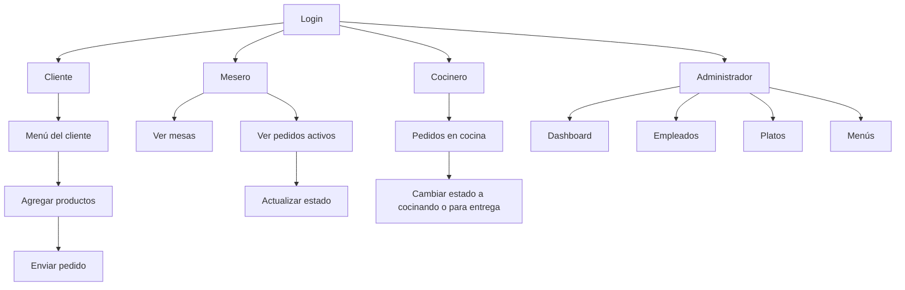

# Arquitectura y flujo del frontend de LogicLab

Este documento explica cómo está organizado el frontend, qué características tiene y cómo se validan y muestran los flujos del proyecto.

---

## 1. Arquitectura general

El frontend está desarrollado con **React + Vite** y está pensado para cubrir los distintos roles del restaurante:

- Cliente
- Mesero
- Cocinero
- Administrador

La aplicación se organiza en tres capas principales:

### 1.1 Componentes
Los componentes contienen la lógica visual y la interacción del usuario.

Principales vistas:

- [src/components/Login.jsx](src/components/Login.jsx) → acceso para empleados y botón para entrar al menú del cliente.
- [src/components/VistaCliente.jsx](src/components/VistaCliente.jsx) → menú digital para el cliente.
- [src/components/Panel_Mesero.jsx](src/components/Panel_Mesero.jsx) → panel para tomar pedidos y supervisar mesas.
- [src/components/Panel_Cocinero.jsx](src/components/Panel_Cocinero.jsx) → vista para cocinar y actualizar estados.
- [src/components/Admin/Panel_Administrador.jsx](src/components/Admin/Panel_Administrador.jsx) → dashboard administrativo.
- [src/components/MenuMesero.jsx](src/components/MenuMesero.jsx) → selección de platos para crear pedidos.
- [src/components/EditarPedido.jsx](src/components/EditarPedido.jsx) → edición de pedidos existentes.
- [src/components/MensajeCliente.jsx](src/components/MensajeCliente.jsx) y [src/components/MensajeCocina.jsx](src/components/MensajeCocina.jsx) → notificaciones de mensajes.

### 1.2 Servicios
Los servicios encapsulan la comunicación con la API.

- [src/services/api.js](src/services/api.js) → configuración central de Axios, manejo de token y URLs base.
- [src/services/menuDia.js](src/services/menuDia.js) → obtención y actualización del menú del día.
- [src/services/pedidos.js](src/services/pedidos.js) → manejo de mesas, pedidos y cambios de estado.

### 1.3 Estilos
Cada módulo visual tiene su propio archivo CSS para mantener el diseño organizado.

- [src/styles](src/styles)

---

## 2. Características principales

### 2.1 Arquitectura multirol
La app permite que cada tipo de usuario vea una interfaz distinta según su rol.

### 2.2 Control de sesión
La sesión se mantiene mediante `localStorage` con datos como:

- `token`
- `usuario`
- `paginaActual`

Esto permite recuperar la vista correcta al recargar la página.

### 2.3 Comunicación con backend
El frontend usa Axios para consumir la API. Además, el interceptor añade automáticamente el token en las peticiones autorizadas.

### 2.4 Manejo de estados reactivos
La interfaz reacciona según cambios como:

- estado de mesas
- estado de pedidos
- cantidad de mensajes pendientes
- disponibilidad del menú del día

### 2.5 Diseño visual por rol
La experiencia visual está separada por secciones específicas para cliente, mesero, cocina y administración.

---

## 3. Cómo se validan los flujos

La validación del frontend se realiza principalmente en la interfaz y en la lógica de estados.

### 3.1 Validación de sesión
El sistema verifica si hay un usuario autenticado antes de permitir el acceso a ciertas vistas.

### 3.2 Validación de login
Al iniciar sesión, la app revisa que la respuesta del backend contenga:

- token
- datos del usuario

Si faltan estos datos, se muestra un error.

### 3.3 Validaciones de negocio en la UI
Ejemplos:

- No se permite enviar un pedido si no hay una mesa activa.
- No se puede editar un pedido si no está en estado `PENDIENTE`.
- Si no hay menú disponible, la interfaz muestra un aviso.

### 3.4 Manejo de errores
Los errores de llamada a la API se capturan con `try/catch` y se muestran al usuario mediante alertas o mensajes visuales.

### 3.5 Estados de carga y feedback
Se usan estados como:

- `cargando`
- `enviando`
- `actualizandoEstado`

Esto permite mostrar mensajes como “Cargando...”, “Procesando...” o “Pedido enviado”.

---

## 4. Cómo se muestran los flujos del proyecto

El flujo principal puede entenderse como un recorrido entre pantallas y estado del sistema.

### 4.1 Flujo general

### 4.2 Flujo de autenticación
1. El usuario ingresa sus credenciales.
2. El sistema lo autentica con el backend.
3. Se guarda el token y el usuario en el almacenamiento local.
4. La app redirige según el rol.

### 4.3 Flujo del pedido
1. El cliente selecciona una mesa.
2. Elige platos y bebidas.
3. Agrega peticiones especiales si aplica.
4. Envía el pedido.
5. El mesero visualiza el pedido.
6. La cocina cambia el estado del pedido.
7. El sistema actualiza la vista según la transición.

---

## 5. Resumen rápido

El frontend cumple tres funciones principales:

- **Mostrar** la interfaz correcta según el rol.
- **Capturar** acciones del usuario.
- **Consumir** la API para actualizar el estado de la aplicación.

En resumen, la arquitectura está basada en:

- React para la UI.
- Axios para comunicación HTTP.
- `localStorage` para persistencia básica.
- componentes separados por funcionalidades.
- CSS específico por pantalla.

---

## 6. Nota final

Este documento describe el frontend de forma general. En una siguiente etapa se puede complementar con la explicación del backend, incluyendo rutas, controladores, lógica de negocio y base de datos.
